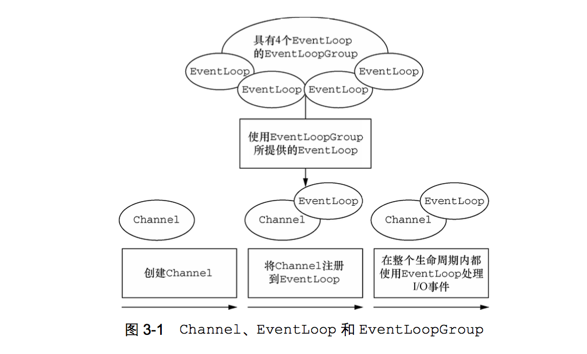
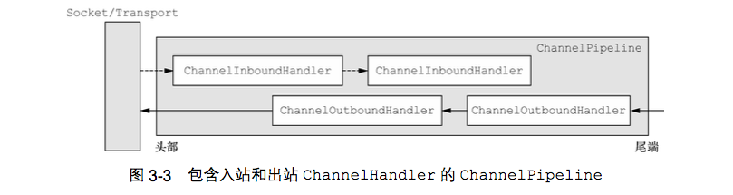
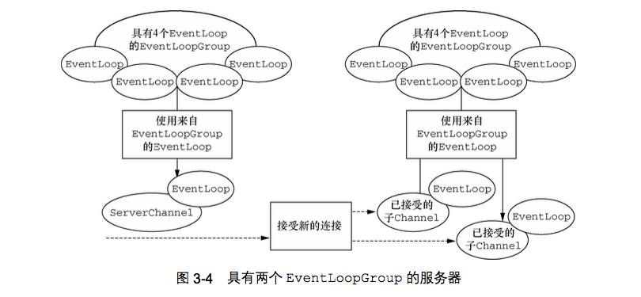
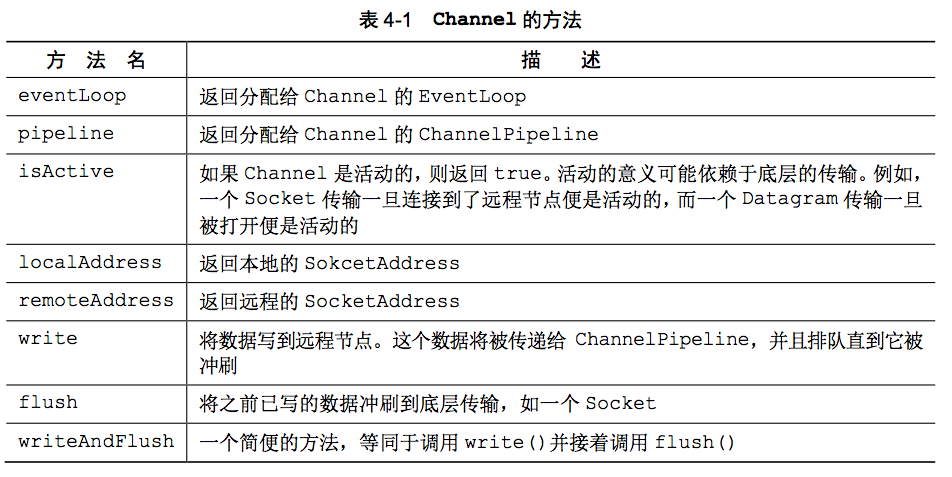
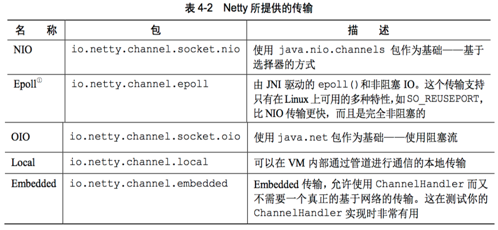
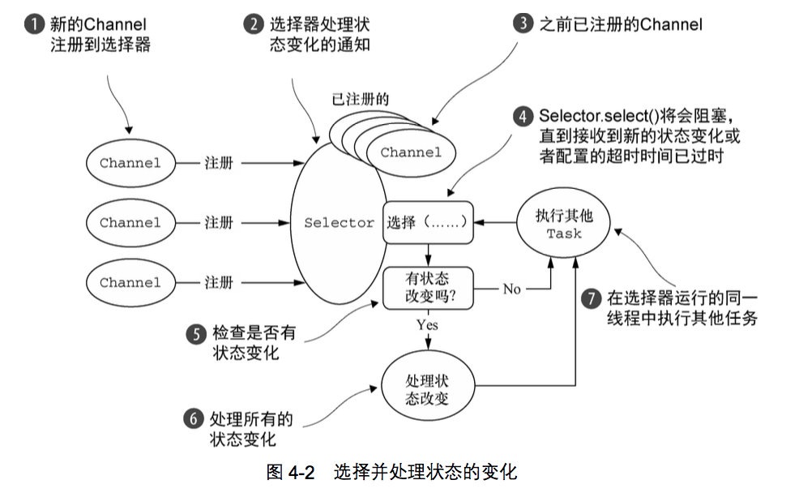

# Netty-In-Action
```
@author 鲁伟林
记录《Netty 实战》中各章节学习过程，写下一些自己的思考和总结，帮助使用Netty框架的开发技术人员们，能够有所得，避免踩坑。
本博客目录结构将严格按照书本《Netty 实战》，省略与Netty无关的内容，可能出现跳小章节。
本博客中涉及的完整代码：
GitHub地址: https://github.com/thinkingfioa/netty-learning/tree/master/netty-in-action。
本人博客地址: https://blog.csdn.net/thinking_fioa
```

# 1. Netty - 异步和事件驱动
- 1. Netty 能够帮助搭建允许系统能够扩展到支持150000名并发用户。
- 2. Netty 设计关键: 异步 + 事件驱动

## 1.1 Java网络编程(BIO)
典型的BIO服务端:

- 1. 一个主线程在某个port监听，等待客户端连接。
- 2. 当接收到客户端发起的连接时，创建一个新的线程去处理客户端请求。
- 3. 主线程重新回到port监听，等待下一个客户端连接。

缺点:

- 1. 每个新的客户端Socket都需要创建一个新的Thread处理，将会导致大量的线程处于休眠状态。
- 2. 每个线程都有调用栈的内存分配，连接数非常多时，耗费较多内存。
- 3. 连接数比较多时，创建大量线程，上下文切换所带来的开销较大。

##### 代码:
```java
public void serve(int port) throws IOException {
	// 创建Socket
    ServerSocket serverSocket = new ServerSocket(port);
    // 等待客户端连接
    Socket clientSocket = serverSocket.accept();
    // 创建输入流
    BufferedReader in = new BufferedReader(new InputStreamReader(clientSocket.getInputStream()));
    PrintWriter out = new PrintWriter(clientSocket.getOutputStream(), true);
    String request, response;
    while((request = in.readLine()) != null) {
        if("Done".equals(request)) {
            break;
        }
        response = processRequest(request);
        out.println(response);
    }
}
```

## 1.2 Java NIO
- 1. 使用Selector来实现Java的非阻塞I/O操作。将多个Socket的读写状态绑定到Selector上，允许在任何时间检查任意的读操作/写操作的完成状态。
- 2. 允许单个线程处理多个并发的连接。

## 1.3 Netty的核心组件
Netty的主要构件块:

- 1. Channel
- 2. 回调
- 3. Future
- 4. 事件和ChannelHandler

### 1.3.1 Channel
Channel是传入(入站)或者传出(出站)数据的载体(如一个文件、一个Socket或一个硬件设备)。可以被打开或者被关闭，连接或断开连接。

### 1.3.2 回调
回调只是：先写一段代码，该段代码在将来某个适当的时候会被执行。Netty大量使用了回调，比如：某ChannelHandler中的channelActive()方法则是一个回调，表示连接建立时，请执行该段回调代码。

### 1.3.3 Future
异步操作占位符。在操作完成时，提供结果的访问。

##### JDK提供的Future和ChannelFuture对比:
- 1. JDK提供的Future需要手动检查对应的操作是否完成，或一直阻塞直到它完成
- 2. ChannelFuture能够注册Listener监听器，监听器的回调函数operationComplete()能异步的在操作完成时被调用。

##### 代码:
```java
public static void connect() {
    Channel channel = CHANNEL_FROM_SOMEWHERE;

    ChannelFuture future = channel.connect(new InetSocketAddress("127.0.0.1", 9080));
    future.addListener(new ChannelFutureListener() {
        @Override
        public void operationComplete(ChannelFuture future) throws Exception {
            if(future.isSuccess()) {
                ByteBuf buf = Unpooled.copiedBuffer("hello", Charset.defaultCharset());
                ChannelFuture wf = future.channel().writeAndFlush(buf);
                // ...
            } else {
            		// 失败后可尝试重连／切换链路
                future.cause().printStackTrace();
            }
        }
    })
}
```

### 1.3.4 事件和ChannelHandler
- 1. 事件：发生某种事件触发适当的动作。比如入站触发事件: 链路激活(channelActive)／数据可读(channelRead)/发生异常(exceptionCaught)/...
- 2. Channelhandler：一组为了响应特定事件而被执行的回调函数。如:ChannelInboundHanderAdapter.java是一个入站事件

### 1.3.5 Channel和EventLoop关系:
Channel和EventLoop都是Netty核心概念，而且有一些约定俗成的规定，能帮助编程和理解:

- 1. 单个Channel只会映射到单个EventLoop
- 2. 单个EventLoop可以处理多个Channel(1:n关系)
- 3. 一个EventLoop在其生命周期内只能绑定到一个线程上
- 4. 由于单个Channel在其生命周期中只会有一个I/O线程，所以ChannelPipeline中多个ChannelHandler无需关心同步互斥问题

# 2. 第一款Netty应用程序
- 1. ChannelHandler用于构建应用业务逻辑。往往封装了为响应特定事件而编写的回调函数
- 2. 本节主要讲解一个超级简单的Netty应用程序，回显服务: 客户端建立连接后，发送一个或多个消息。服务端收到后，将消息返回。

## 2.3 编写Echo服务器
Netty服务端至少需要两个部分: 一个ChannelHandler + 引导(Bootstrap)

### 2.3.1 ChannelHandler和业务逻辑
继承ChannelInboundHandlerAdapter类，感兴趣的入站方法:

- 1. channelRead() - 对于每个传入的消息都要调用
- 2. channelReadComplete() - 当前批量读取中的最后一条数据
- 3. exceptionCaught() - 读取操作期间，有异常抛出时调用

##### 代码:
```java
@ChannelHandler.Sharable
public class EchoServerHandler extends ChannelInboundHandlerAdapter{

    /**
     * 每次传入的消息都要调用
     */
    @Override
    public void channelRead(ChannelHandlerContext ctx, Object msg) {
        ByteBuf in = (ByteBuf) msg;
        System.out.println(
                "Server received: " + in.toString(CharsetUtil.UTF_8));
        ctx.write(in);
    }

    /**
     * 读完当前批量中的最后一条数据后，触发channelReadComplete(...)方法
     */
    @Override
    public void channelReadComplete(ChannelHandlerContext ctx)
            throws Exception {
        ctx.writeAndFlush(Unpooled.EMPTY_BUFFER)
                .addListener(ChannelFutureListener.CLOSE);
    }

    /**
     * 异常捕获
     */
    @Override
    public void exceptionCaught(ChannelHandlerContext ctx,
                                Throwable cause) {
        cause.printStackTrace();
        ctx.close();
    }
}
```
解释:

- 1. channelRead和channelReadComplete理解：当批量消息后最后一条数据被channelRead(...)后触发channelReadComplete事件。
- 2. ctx.write(...)只是将消息暂时存放在ChannelOutboundBuffer中，等待flush(...)操作
- 3. @Sharable注解：本质是声明该ChannelHandler全局单例。可被多个Channel安全的共享。标注了@Sharable注解的ChannelHandler请注意不能有对应的状态
- 4. [完整代码地址](https://github.com/thinkingfioa/netty-learning/tree/master/netty-in-action)

### 2.3.2 引导服务器
- 1. 引导服务器主要打开Netty的Channel。并分配对应的EventLoop和ChannelPipeline。
- 2. 一个Channel只有一个ChannelPipeline。ChannelPipeline是由一组ChannelHandler组成的责任链。

##### 代码:
```java
EventLoopGroup group = new NioEventLoopGroup();
try {
    ServerBootstrap b = new ServerBootstrap();
    b.group(group)
            .channel(NioServerSocketChannel.class)
            .localAddress(new InetSocketAddress(port))
            .childHandler(new ChannelInitializer<SocketChannel>() {
                @Override
                public void initChannel(SocketChannel ch) throws Exception {
                    ch.pipeline().addLast(new EchoServerHandler());
                }
            });
} finally {
    group.shutdownGracefully().sync();
}
```

## 2.4 编写Echo客户端
客户端将会:

- 1. 建立连接
- 2. 发送消息
- 3. 关闭连接

### 2.4.1 ChannelHandler客户端逻辑
- 1. Java是通过GC可达性分析来实现垃圾回收。对于Netty传输中的ByteBuf，使用的是引用计数算法。也就是说：如果你使用了Netty，需要你亲自考虑是否需要手动释放对象。判断方法，后文将会给出
- 2. 扩展SimpleChannelInboundHandler类处理任务的Handler，无需手动释放对象。SimpleChannelInboundHandler.java中方法channelRead()中会负责释放引用。
- 3. 客户端发送消息条数和服务端接收的消息条数是不对应的。除非处理了TCP的粘包黏包。

##### 代码:
```java
// SimpleChannelInboundHandler<T>中channelRead方法负责释放对象msg引用
public abstract class SimpleChannelInboundHandler<I> ...{
    public void channelRead(ChannelHandlerContext ctx, Object msg) throws Exception {
        boolean release = true;
        try {
        // ...
        } finally {
            if (autoRelease && release) {
            	  // 减少对象msg引用计数
                ReferenceCountUtil.release(msg);
            }
        }
    }
}    
```

##### 问：ChannelHandler中何时需要主动释放引用?
- 1. 扩展的类不是: SimpleChannelInboundHandler，且该对象msg不会传给下一个ChannelHandler
- 2. 扩展的类不是: SimpleChannelInboundHandler，且该对象msg不会被ctx.write(...)

### 2.4.2 引导客户端
给出引导客户端关键代码，完整代码请参考[地址](https://github.com/thinkingfioa/netty-learning/tree/master/netty-in-action)

##### 代码:
```java
EventLoopGroup group = new NioEventLoopGroup();
try {
    Bootstrap b = new Bootstrap();
    b.group(group)
            .channel(NioSocketChannel.class)
            .remoteAddress(new InetSocketAddress(host, port))
            .handler(new ChannelInitializer<SocketChannel>() {
                @Override
                public void initChannel(SocketChannel ch)
                        throws Exception {
                    ch.pipeline().addLast(
                            new EchoClientHandler());
                }
            });
    // 下面两行代码可以删除
    ChannelFuture f = b.connect().sync();
    f.channel().closeFuture().sync();
} finally {
    group.shutdownGracefully().sync();
}
```

# 3. Netty的组件和设计
Netty源码设计非常优秀。主要体现在技术方面和体系结构方面。

- 1. Netty基于Java NIO的异步和事件驱动的实现，保证了高负载下应用程序性能的最大化和可伸缩性。
- 2. Netty使用众多设计模式，将应用程序从网络层解耦。

## 3.1 Channel、EventLoop和ChannelFuture
Channel、EventLoop和ChannelFuture是Netty用于对网络进行的抽象:

- 1. Channel ------ Socket
- 2. EventLoop ------ 控制流、多线程和并发
- 3. ChannelFuture ------ 异步通知

### 3.1.1 Channel 接口
- 1. EmbeddedChannel ----- Embedded传输
- 2. LocalServerChannel ----- Local传输
- 3. NioDatagramChannel ----- UDP协议NIO传输
- 4. NioSctpChannel ----- SCTP协议NIO传输(基于Session)
- 5. NioSocketChannel ----- TCP协议NIO传输

### 3.1.2 EventLoop 接口
- 1. EventLoop是Netty中非常重要的组件，EventLoop用于处理生命周期中发生的所有事件。
- 2. 与EventLoop绑定的Thread称为I/O线程，用于处理整个Channel生命周期中的I/O事件。
- 3. 下图说明Channel、EventLoop、Thread以及EventLoopGroup之间的关系



##### 约定俗成的关系(**非常重要**):
- 1. 一个EventLoopGroup包含一个或多个EventLoop
- 2. 一个EventLoop在其生命周期内只能和一个Thread绑定
- 3. 由EventLoop处理的I/O事件都由它绑定的Thread处理
- 4. 一个Channel在其生命周期内，只能注册于一个EventLoop
- 5. 一个EventLoop可能被分配处理多个Channel。也就是EventLoop与Channel是1:n的关系
- 6. 一个Channel上的所有ChannelHandler的事件由绑定的EventLoop中的I/O线程处理
- 7. 不要阻塞Channel的I/O线程，可能会影响该EventLoop中其他Channel事件处理

### 3.1.3 ChannelFuture 接口
Netty中所有的I/O操作都是异步的，该异步操作可能无法立即得到返回。Netty提供addListener()方法注册回调函数。

- 1. 可以将ChannelFuture看作是将来要执行的操作的结果占位符，什么时候被执行，不知道。但肯定会被执行
- 2. 属于同一个Channel的操作(回调函数)都被保证将按照注册的顺序执行。

## 3.2 ChannelHandler 和 ChannelPipeline

### 3.2.1 ChannelHandler 接口
- 1. Netty提供了很多扩展的ChannelHandler。如ChannelInboundHandler处理入站事件。
- 2. ChannelHandler的方法，就是常说的事件。如:channelActive(链路激活事件)等。所以，ChannelHandler可以说是处理事件的具体业务代码逻辑。

### 3.2.2 ChannelPipeline 接口

- 1. ChannelPipeline本质上是ChannelHandler链的容器
- 2. ChannelHandler是处理Channel上的入站和出站事件的代码。
- 3. ChannelHandler对象接收事件触发并执行实现的业务逻辑，接着传递给链中的下一个ChannelHandler处理
- 4. 请注意下图中头部-尾端，Netty的头部-尾端是规定的，需要记住。



##### 上图解释:

- 1. 一个入站事件被读取，从ChannelPipeline头部开始流动，传递给第一个ChannelInBoundHandler
- 2. 一个出站事件触发，从链路尾端的ChannelOutboundHandler开始流动，直到它到达链的头部为止。

### 3.2.3 channel.write(...)和channelHandlerContext.write(...)区别
- 1. channel.write(...) ----- 消息从ChannelPipeline中的下一个ChannelHandler开始流转
- 2. channelHandlerContext.write(...) ----- 消息直接从ChannelPipeline的尾端开始流转
- 3. ctx.write(...)的性能**优于**channel.write(...)

### 3.2.4 编码器和解码器
- 1. Netty提供多种编码器和解码器，比如:ProtobufDecoder或ProtobufEncoder。
- 2. 编码器/解码器中覆写了channelRead()方法，在方法里调用encode()/decode()方法。再传递给下一个ChannelHandler处理.
- 3. 解码器添加在入站事件的头部，编码器添加在出站事件的头部。天然的解决了网络数据的编解码，非常优秀的设计。

## 3.3 引导
Netty有两种类型的引导: 客户端(Bootstrap)和服务端(ServerBootstrap)

- 1. Bootstrap(客户端) - 连接远程的主机和端口
- 2. ServerBootstrap(服务端) - 两个端口。第一个是本地监听端口，第二个是与tcp连接端口。
- 3. 客户端需要一个EventLoopGroup；服务端需要两个EventLoopGroup

### 3.3.1 服务端需要两个EventLoopGroup
Netty的服务端负责两项任务: 

- 1. 监听本地端口，等待客户端连接。
- 2. 建立客户端通信的临时分配的端口。所以服务端有两个EventLoopGroup，通常称为: bossEventLoopGroup + workerEventLoopGroup.



##### 上图解释:
- 1. 上图左边的是ServerChannel，用于监听本地端口的通道。对应于bossEventLoopGroup
- 2. 右边的是与具体客户端连接的channel，用于数据通信。对应于workerEventLoopGroup

##### 代码:
```java
private EventLoopGroup bossGroup = new NioEventLoopGroup();
private EventLoopGroup workerGroup = new NioEventLoopGroup(2,...);

public void bind(int port) throws InterruptedException {
    ServerBootstrap bootstrap = new ServerBootstrap();
    bootstrap.group(bossGroup, workerGroup)
            .channel(NioServerSocketChannel.class)
            .option(ChannelOption.SO_BACKLOG, 1024)
            .childHandler(new ChildChannelHandler());

    ChannelFuture cf = bootstrap.bind(port);
    cf.addListener(new ChannelFutureListener() {
        @Override
        public void operationComplete(ChannelFuture future) throws Exception {
            if(future.isSuccess()) {
                LOGGER.info("netty server bind success.");
            } else {
                LOGGER.error("netty server bind fail.", future.cause());
            }
        }
    });
}
```

# 第4章 传输
- 1. 网络中传输的数据总是：字节。所有经过网络传播的对象，最终都要通过序列化／反序列化变成字节流。
- 2. Netty支持多种序列化／反序列化。比如:ProtoBuf、Marshalling或Kryo。关于Netty序列化内容和多种序列化方式的性能比较，可参考我的另一个博客[Netty私有化协议](https://github.com/thinkingfioa/netty-learning/tree/master/netty-private-protocol)

## 4.1 案例研究: 传输迁徙
- 1. Java提供的阻塞(OIO)和异步(NIO)的代码完全不同。如果一个项目想从Java原始的OIO迁移到NIO，代价巨大。
- 2. Netty提供的阻塞(OIO)和异步(NIO)的代码只有一行不同。无代价
- 4. 具体代码地址请参考[chapter4代码](https://github.com/thinkingfioa/netty-learning/tree/master/netty-in-action/src/main/java/org/lwl/netty/chapter/four)

## 4.2 传输API
Netty的传输API重点关注3个重要组件: Channel、ChannelPipeline和ChannelConfig

- 1. Channel ----- 是核心，所有的I/O操作都是围绕这个Channel
- 2. ChannelPipeline ----- 持有所有应用于入站和出站事件以及数据的ChannelHandler实例。
- 3. ChannelConfig ----- 包含该Channel的所有配置信息

### 4.2.1 ChannelHandler的典型用途
- 1. 将数据从一种格式转换成另一种格式 ----- 编码器/解码器
- 2. 异常通知 ----- exceptionCaught事件
- 3. 提供Channel变为活动或者非活动的通知 ----- channelActive/channelInactive
- 4. 提供用户自定义事件的通知 ---- fireUserEventTriggered。

##### 注:
可以利用上面的第4点：用户自定义事件的通知。实现Pipeline动态编排ChannelHandler。可参考项目中如何实现。[动态编排Handler链](//TODO::动态编排Handler链)

### 4.2.2 Channel
下图是Channel的方法。


##### 注:
上图中isActive在tcp和udp特性是不同的。tcp只有与远程建立连接后，isActive才会被触发。udp是无连接的协议，Channel一旦被打开，便激活。所以无法通过isActive来判断udp的另一端是否正常。

### 4.2.3 Channel线程安全(请铭记)
- 1. Netty中的Channel是线程安全的。应为单个Channel在其生命周期间，任何I/O事件都交由EventLoop所绑定的线程处理。
- 2. 多个线程同时获得同一个Channel，都调用writeAndFlush(...)方法。不用担心，Netty的Channel是线程安全的。
- 3. Netty的操作都是异步的，多个线程调用writeAndFlush(...)后，函数立即返回。真正开始写数据操作，一定由指定的I/O线程执行。
- 4. Netty同时保证：多个线程消息，消息将会被保证按顺序发送

## 4.3 内置的传输(NIO/Epoll/OIO/Local/Embedded)
Netty提供5种NIO/Epoll/OIO/Local/Embedded开箱即用的传输。开发人员应该选择适合自己协议的传输类型。


### 4.3.1 NIO ------ 非阻塞I/O
Netty常用的传输类型(NIO)。利用选择器(Selector)管理多个Channel的状态。下图可帮助理解


### 4.3.2 Epoll ------ 用于Linux的本地非阻塞传输
- 1. Epoll是适用于Linux系统。而NIO则适用于所有的操作系统
- 2. Epoll的速度 > NIO速度
- 3. 想从NIO传输转变为Epoll传输，只需要改变2行代码

##### 代码:
```java
//从NIO传输转变为Epoll传输，只需要改变2行代码
1> NioEventLoopGroup  --->  EpollEventLoopGroup
2> NioServerSocketChannel.class  ---> EpollServerSocketChannel.class
```

### 4.3.3 OIO ------ 旧的阻塞I/O
典型的OIO思路: 启动一个监听某端口的SeverSocket的线程。当有新的客户端连接后，分配一个线程去响应新的客户端的事件。

### 4.3.4 Local ------ 用于JVM内部通信的Local传输
同一个JVM中运行的客户端和服务端程序之间的异步通信。目前尚未使用过，后续使用了再补充

### 4.3.5 Embedded传输 ------ 常用来编写单元测试
- 1. 将一组ChannelHandler植入到其他的Channel内部
- 2. Embedded传输常用来编写ChannelHandler单元测试用例。后文会给出案例，帮助理解。

### 4.3.6 零拷贝问题探讨
- 1. 零拷贝: 无需将数据从内核空间复制到用户空间
- 2. 目前只有使用NIO传输和Epoll传输才可使用零拷贝特性
- 3. 请区别于：直接内存和堆内存之间的拷贝。

# 第5章 ByteBuf


# 附录
- 1. [完整代码地址](https://github.com/thinkingfioa/netty-learning/tree/master/netty-in-action)
- 2. [netty-in-action书籍下载地址](https://github.com/thinkingfioa/netty-learning/tree/master/netty-in-action/docs)


