# Netty-In-Action
```
@author 鲁伟林
记录《Netty 实战》中各章节学习过程，写下一些自己的思考和总结，帮助使用Netty框架的开发技术人员们，能够有所得，避免踩坑。
本博客目录结构将严格按照书本《Netty 实战》，省略与Netty无关的内容，可能出现跳小章节。
本博客中涉及的完整代码：
GitHub地址: https://github.com/thinkingfioa/netty-learning/tree/master/netty-in-action。
本人博客地址: https://blog.csdn.net/thinking_fioa
```

# 1. Netty - 异步和事件驱动
- 1. Netty 能够帮助搭建允许系统能够扩展到支持150000名并发用户。
- 2. Netty 设计关键: 异步 + 事件驱动

## 1.1 Java网络编程(BIO)
典型的BIO服务端:

- 1. 一个主线程在某个port监听，等待客户端连接。
- 2. 当接收到客户端发起的连接时，创建一个新的线程去处理客户端请求。
- 3. 主线程重新回到port监听，等待下一个客户端连接。

缺点:

- 1. 每个新的客户端Socket都需要创建一个新的Thread处理，将会导致大量的线程处于休眠状态。
- 2. 每个线程都有调用栈的内存分配，连接数非常多时，耗费较多内存。
- 3. 连接数比较多时，创建大量线程，上下文切换所带来的开销较大。

##### 代码:
```java
public void serve(int port) throws IOException {
	// 创建Socket
    ServerSocket serverSocket = new ServerSocket(port);
    // 等待客户端连接
    Socket clientSocket = serverSocket.accept();
    // 创建输入流
    BufferedReader in = new BufferedReader(new InputStreamReader(clientSocket.getInputStream()));
    PrintWriter out = new PrintWriter(clientSocket.getOutputStream(), true);
    String request, response;
    while((request = in.readLine()) != null) {
        if("Done".equals(request)) {
            break;
        }
        response = processRequest(request);
        out.println(response);
    }
}
```

## 1.2 Java NIO
- 1. 使用Selector来实现Java的非阻塞I/O操作。将多个Socket的读写状态绑定到Selector上，允许在任何时间检查任意的读操作/写操作的完成状态。
- 2. 允许单个线程处理多个并发的连接。

## 1.3 Netty的核心组件
Netty的主要构件块:

- 1. Channel
- 2. 回调
- 3. Future
- 4. 事件和ChannelHandler

### 1.3.1 Channel
Channel是传入(入站)或者传出(出站)数据的载体(如一个文件、一个Socket或一个硬件设备)。可以被打开或者被关闭，连接或断开连接。

### 1.3.2 回调
回调只是：先写一段代码，该段代码在将来某个适当的时候会被执行。Netty大量使用了回调，比如：某ChannelHandler中的channelActive()方法则是一个回调，表示连接建立时，请执行该段回调代码。

### 1.3.3 Future
异步操作占位符。在操作完成时，提供结果的访问。

##### JDK提供的Future和ChannelFuture对比:
- 1. JDK提供的Future需要手动检查对应的操作是否完成，或一直阻塞直到它完成
- 2. ChannelFuture能够注册Listener监听器，监听器的回调函数operationComplete()能异步的在操作完成时被调用。

##### 代码:
```java
public static void connect() {
    Channel channel = CHANNEL_FROM_SOMEWHERE;

    ChannelFuture future = channel.connect(new InetSocketAddress("127.0.0.1", 9080));
    future.addListener(new ChannelFutureListener() {
        @Override
        public void operationComplete(ChannelFuture future) throws Exception {
            if(future.isSuccess()) {
                ByteBuf buf = Unpooled.copiedBuffer("hello", Charset.defaultCharset());
                ChannelFuture wf = future.channel().writeAndFlush(buf);
                // ...
            } else {
            		// 失败后可尝试重连／切换链路
                future.cause().printStackTrace();
            }
        }
    })
}
```

### 1.3.4 事件和ChannelHandler
- 1. 事件：发生某种事件触发适当的动作。比如入站触发事件: 链路激活(channelActive)／数据可读(channelRead)/发生异常(exceptionCaught)/...
- 2. Channelhandler：一组为了响应特定事件而被执行的回调函数。如:ChannelInboundHanderAdapter.java是一个入站事件

### 1.3.5 Channel和EventLoop关系:
Channel和EventLoop都是Netty核心概念，而且有一些约定俗成的规定，能帮助编程和理解:

- 1. 单个Channel只会映射到单个EventLoop
- 2. 单个EventLoop可以处理多个Channel(1:n关系)
- 3. 一个EventLoop在其生命周期内只能绑定到一个线程上
- 4. 由于单个Channel在其生命周期中只会有一个I/O线程，所以ChannelPipeline中多个ChannelHandler无需关心同步互斥问题

# 2. 第一款Netty应用程序
- 1. ChannelHandler用于构建应用业务逻辑。往往封装了为响应特定事件而编写的回调函数
- 2. 本节主要讲解一个超级简单的Netty应用程序，回显服务: 客户端建立连接后，发送一个或多个消息。服务端收到后，将消息返回。

## 2.3 编写Echo服务器
Netty服务端至少需要两个部分: 一个ChannelHandler + 引导(Bootstrap)

### 2.3.1 ChannelHandler和业务逻辑
继承ChannelInboundHandlerAdapter类，感兴趣的入站方法:

- 1. channelRead() - 对于每个传入的消息都要调用
- 2. channelReadComplete() - 当前批量读取中的最后一条数据
- 3. exceptionCaught() - 读取操作期间，有异常抛出时调用

##### 代码:
```java
@ChannelHandler.Sharable
public class EchoServerHandler extends ChannelInboundHandlerAdapter{

    /**
     * 每次传入的消息都要调用
     */
    @Override
    public void channelRead(ChannelHandlerContext ctx, Object msg) {
        ByteBuf in = (ByteBuf) msg;
        System.out.println(
                "Server received: " + in.toString(CharsetUtil.UTF_8));
        ctx.write(in);
    }

    /**
     * 读完当前批量中的最后一条数据后，触发channelReadComplete(...)方法
     */
    @Override
    public void channelReadComplete(ChannelHandlerContext ctx)
            throws Exception {
        ctx.writeAndFlush(Unpooled.EMPTY_BUFFER)
                .addListener(ChannelFutureListener.CLOSE);
    }

    /**
     * 异常捕获
     */
    @Override
    public void exceptionCaught(ChannelHandlerContext ctx,
                                Throwable cause) {
        cause.printStackTrace();
        ctx.close();
    }
}
```
解释:

- 1. channelRead和channelReadComplete理解：当批量消息后最后一条数据被channelRead(...)后触发channelReadComplete事件。
- 2. ctx.write(...)只是将消息暂时存放在ChannelOutboundBuffer中，等待flush(...)操作
- 3. @Sharable注解：本质是声明该ChannelHandler全局单例。可被多个Channel安全的共享。标注了@Sharable注解的ChannelHandler请注意不能有对应的状态
- 4. [完整代码地址](https://github.com/thinkingfioa/netty-learning/tree/master/netty-in-action)

### 2.3.2 引导服务器
- 1. 引导服务器主要打开Netty的Channel。并分配对应的EventLoop和ChannelPipeline。
- 2. 一个Channel只有一个ChannelPipeline。ChannelPipeline是由一组ChannelHandler组成的责任链。

##### 代码:
```java
EventLoopGroup group = new NioEventLoopGroup();
try {
    ServerBootstrap b = new ServerBootstrap();
    b.group(group)
            .channel(NioServerSocketChannel.class)
            .localAddress(new InetSocketAddress(port))
            .childHandler(new ChannelInitializer<SocketChannel>() {
                @Override
                public void initChannel(SocketChannel ch) throws Exception {
                    ch.pipeline().addLast(new EchoServerHandler());
                }
            });
} finally {
    group.shutdownGracefully().sync();
}
```

## 2.4 编写Echo客户端
客户端将会:

- 1. 建立连接
- 2. 发送消息
- 3. 关闭连接

### 2.4.1 ChannelHandler客户端逻辑
- 1. Java是通过GC可达性分析来实现垃圾回收。对于Netty传输中的ByteBuf，使用的是引用计数算法。也就是说：如果你使用了Netty，需要你亲自考虑是否需要手动释放对象。判断方法，后文将会给出
- 2. 扩展SimpleChannelInboundHandler类处理任务的Handler，无需手动释放对象。SimpleChannelInboundHandler.java中方法channelRead()中会负责释放引用。
- 3. 客户端发送消息条数和服务端接收的消息条数是不对应的。除非处理了TCP的粘包黏包。

##### 代码:
```java
// SimpleChannelInboundHandler<T>中channelRead方法负责释放对象msg引用
public abstract class SimpleChannelInboundHandler<I> ...{
    public void channelRead(ChannelHandlerContext ctx, Object msg) throws Exception {
        boolean release = true;
        try {
        // ...
        } finally {
            if (autoRelease && release) {
            	  // 减少对象msg引用计数
                ReferenceCountUtil.release(msg);
            }
        }
    }
}    
```

##### 问：ChannelHandler中何时需要主动释放引用?
- 1. 扩展的类不是: SimpleChannelInboundHandler，且该对象msg不会传给下一个ChannelHandler
- 2. 扩展的类不是: SimpleChannelInboundHandler，且该对象msg不会被ctx.write(...)

### 2.4.2 引导客户端
给出引导客户端关键代码，完整代码请参考[地址](https://github.com/thinkingfioa/netty-learning/tree/master/netty-in-action)

##### 代码:
```java
EventLoopGroup group = new NioEventLoopGroup();
try {
    Bootstrap b = new Bootstrap();
    b.group(group)
            .channel(NioSocketChannel.class)
            .remoteAddress(new InetSocketAddress(host, port))
            .handler(new ChannelInitializer<SocketChannel>() {
                @Override
                public void initChannel(SocketChannel ch)
                        throws Exception {
                    ch.pipeline().addLast(
                            new EchoClientHandler());
                }
            });
    // 下面两行代码可以删除
    ChannelFuture f = b.connect().sync();
    f.channel().closeFuture().sync();
} finally {
    group.shutdownGracefully().sync();
}
```

# 3. Netty的组件和设计
Netty源码设计非常优秀。主要体现在技术方面和体系结构方面。

- 1. Netty基于Java NIO的异步和事件驱动的实现，保证了高负载下应用程序性能的最大化和可伸缩性。
- 2. Netty使用众多设计模式，将应用程序从网络层解耦。

## 3.1 Channel、EventLoop和ChannelFuture
Channel、EventLoop和ChannelFuture是Netty用于对网络进行的抽象:

- 1. Channel ------ Socket
- 2. EventLoop ------ 控制流、多线程和并发
- 3. ChannelFuture ------ 异步通知

### 3.1.1 Channel 接口
- 1. EmbeddedChannel ----- Embedded传输
- 2. LocalServerChannel ----- Local传输
- 3. NioDatagramChannel ----- UDP协议NIO传输
- 4. NioSctpChannel ----- SCTP协议NIO传输(基于Session)
- 5. NioSocketChannel ----- TCP协议NIO传输

### 3.1.2 EventLoop 接口
- 1. EventLoop是Netty中非常重要的组件，EventLoop用于处理生命周期中发生的所有事件。
- 2. 与EventLoop绑定的Thread称为I/O线程，用于处理整个Channel生命周期中的I/O事件。
- 3. 下图说明Channel、EventLoop、Thread以及EventLoopGroup之间的关系


##### 约定俗成的关系(**非常重要**):
- 1. 一个EventLoopGroup包含一个或多个EventLoop
- 2. 一个EventLoop在其生命周期内只能和一个Thread绑定
- 3. 由EventLoop处理的I/O事件都由它绑定的Thread处理
- 4. 一个Channel在其生命周期内，只能注册于一个EventLoop
- 5. 一个EventLoop可能被分配处理多个Channel。也就是EventLoop与Channel是1:n的关系
- 6. 一个Channel上的所有ChannelHandler的事件由绑定的EventLoop中的I/O线程处理
- 7. 不要阻塞Channel的I/O线程，可能会影响该EventLoop中其他Channel事件处理

### 3.1.3 ChannelFuture 接口
Netty中所有的I/O操作都是异步的，该异步操作可能无法立即得到返回。Netty提供addListener()方法注册回调函数。

- 1. 可以将ChannelFuture看作是将来要执行的操作的结果占位符，什么时候被执行，不知道。但肯定会被执行
- 2. 属于同一个Channel的操作(回调函数)都被保证将按照注册的顺序执行。

## 3.2 ChannelHandler 和 ChannelPipeline

### 3.2.1 ChannelHandler 接口
- 1. Netty提供了很多扩展的ChannelHandler。如ChannelInboundHandler处理入站事件。
- 2. ChannelHandler的方法，就是常说的事件。如:channelActive(链路激活事件)等。所以，ChannelHandler可以说是处理事件的具体业务代码逻辑。

### 3.2.2 ChannelPipeline 接口

- 1. ChannelPipeline本质上是ChannelHandler链的容器
- 2. ChannelHandler是处理Channel上的入站和出站事件的代码。
- 3. ChannelHandler对象接收事件触发并执行实现的业务逻辑，接着传递给链中的下一个ChannelHandler处理
- 4. 请注意下图中头部-尾端，Netty的头部-尾端是规定的，需要记住。


##### 上图解释:

- 1. 一个入站事件被读取，从ChannelPipeline头部开始流动，传递给第一个ChannelInBoundHandler
- 2. 一个出站事件触发，从链路尾端的ChannelOutboundHandler开始流动，直到它到达链的头部为止。

### 3.2.3 channel.write(...)和channelHandlerContext.write(...)区别
- 1. channel.write(...) ----- 消息从ChannelPipeline中的下一个ChannelHandler开始流转
- 2. channelHandlerContext.write(...) ----- 消息直接从ChannelPipeline的尾端开始流转
- 3. ctx.write(...)的性能**优于**channel.write(...)
- 4. channelHandlerContext.write(...)是将消息从当前的出站队列Hanlder往头部传。 channel.write(...)是从ChannelPipeline的尾部开始往头部传。如果没有理解这点，请看下文。

### 3.2.4 编码器和解码器
- 1. Netty提供多种编码器和解码器，比如:ProtobufDecoder或ProtobufEncoder。
- 2. 编码器/解码器中覆写了channelRead()方法，在方法里调用encode()/decode()方法。再传递给下一个ChannelHandler处理.
- 3. 解码器添加在入站事件的头部，编码器添加在出站事件的头部。天然的解决了网络数据的编解码，非常优秀的设计。

## 3.3 引导
Netty有两种类型的引导: 客户端(Bootstrap)和服务端(ServerBootstrap)

- 1. Bootstrap(客户端) - 连接远程的主机和端口
- 2. ServerBootstrap(服务端) - 两个端口。第一个是本地监听端口，第二个是与tcp连接端口。
- 3. 客户端需要一个EventLoopGroup；服务端需要两个EventLoopGroup

### 3.3.1 服务端需要两个EventLoopGroup
Netty的服务端负责两项任务: 

- 1. 监听本地端口，等待客户端连接。
- 2. 建立客户端通信的临时分配的端口。所以服务端有两个EventLoopGroup，通常称为: bossEventLoopGroup + workerEventLoopGroup.


##### 上图解释:
- 1. 上图左边的是ServerChannel，用于监听本地端口的通道。对应于bossEventLoopGroup
- 2. 右边的是与具体客户端连接的channel，用于数据通信。对应于workerEventLoopGroup

##### 代码:
```java
private EventLoopGroup bossGroup = new NioEventLoopGroup();
private EventLoopGroup workerGroup = new NioEventLoopGroup(2,...);

public void bind(int port) throws InterruptedException {
    ServerBootstrap bootstrap = new ServerBootstrap();
    bootstrap.group(bossGroup, workerGroup)
            .channel(NioServerSocketChannel.class)
            .option(ChannelOption.SO_BACKLOG, 1024)
            .childHandler(new ChildChannelHandler());

    ChannelFuture cf = bootstrap.bind(port);
    cf.addListener(new ChannelFutureListener() {
        @Override
        public void operationComplete(ChannelFuture future) throws Exception {
            if(future.isSuccess()) {
                LOGGER.info("netty server bind success.");
            } else {
                LOGGER.error("netty server bind fail.", future.cause());
            }
        }
    });
}
```

# 第4章 传输
- 1. 网络中传输的数据总是：字节。所有经过网络传播的对象，最终都要通过序列化／反序列化变成字节流。
- 2. Netty支持多种序列化／反序列化。比如:ProtoBuf、Marshalling或Kryo。关于Netty序列化内容和多种序列化方式的性能比较，可参考我的另一个博客[Netty私有化协议](https://github.com/thinkingfioa/netty-learning/tree/master/netty-private-protocol)

## 4.1 案例研究: 传输迁徙
- 1. Java提供的阻塞(OIO)和异步(NIO)的代码完全不同。如果一个项目想从Java原始的OIO迁移到NIO，代价巨大。
- 2. Netty提供的阻塞(OIO)和异步(NIO)的代码只有一行不同。无代价
- 4. 具体代码地址请参考[chapter4代码](https://github.com/thinkingfioa/netty-learning/tree/master/netty-in-action/src/main/java/org/lwl/netty/chapter/four)

## 4.2 传输API
Netty的传输API重点关注3个重要组件: Channel、ChannelPipeline和ChannelConfig

- 1. Channel ----- 是核心，所有的I/O操作都是围绕这个Channel
- 2. ChannelPipeline ----- 持有所有应用于入站和出站事件以及数据的ChannelHandler实例。
- 3. ChannelConfig ----- 包含该Channel的所有配置信息

### 4.2.1 ChannelHandler的典型用途
- 1. 将数据从一种格式转换成另一种格式 ----- 编码器/解码器
- 2. 异常通知 ----- exceptionCaught事件
- 3. 提供Channel变为活动或者非活动的通知 ----- channelActive/channelInactive
- 4. 提供用户自定义事件的通知 ---- fireUserEventTriggered。

##### 注:
可以利用上面的第4点：用户自定义事件的通知。实现Pipeline动态编排ChannelHandler。可参考项目中如何实现。[动态编排Handler链](//TODO::动态编排Handler链)

### 4.2.2 Channel
下图是Channel的方法。


##### 注:
上图中isActive在tcp和udp特性是不同的。tcp只有与远程建立连接后，isActive才会被触发。udp是无连接的协议，Channel一旦被打开，便激活。所以无法通过isActive来判断udp的另一端是否正常。

### 4.2.3 Channel线程安全(请铭记)
- 1. Netty中的Channel是线程安全的。应为单个Channel在其生命周期间，任何I/O事件都交由EventLoop所绑定的线程处理。
- 2. 多个线程同时获得同一个Channel，都调用writeAndFlush(...)方法。不用担心，Netty的Channel是线程安全的。
- 3. Netty的操作都是异步的，多个线程调用writeAndFlush(...)后，函数立即返回。真正开始写数据操作，一定由指定的I/O线程执行。
- 4. Netty同时保证：多个线程消息，消息将会被保证按顺序发送

## 4.3 内置的传输(NIO/Epoll/OIO/Local/Embedded)
Netty提供5种NIO/Epoll/OIO/Local/Embedded开箱即用的传输。开发人员应该选择适合自己协议的传输类型。


### 4.3.1 NIO ------ 非阻塞I/O
Netty常用的传输类型(NIO)。利用选择器(Selector)管理多个Channel的状态。下图可帮助理解


### 4.3.2 Epoll ------ 用于Linux的本地非阻塞传输
- 1. Epoll是适用于Linux系统。而NIO则适用于所有的操作系统
- 2. Epoll的速度 > NIO速度
- 3. 想从NIO传输转变为Epoll传输，只需要改变2行代码

##### 代码:
```java
//从NIO传输转变为Epoll传输，只需要改变2行代码
1> NioEventLoopGroup  --->  EpollEventLoopGroup
2> NioServerSocketChannel.class  ---> EpollServerSocketChannel.class
```

### 4.3.3 OIO ------ 旧的阻塞I/O
典型的OIO思路: 启动一个监听某端口的SeverSocket的线程。当有新的客户端连接后，分配一个线程去响应新的客户端的事件。

### 4.3.4 Local ------ 用于JVM内部通信的Local传输
同一个JVM中运行的客户端和服务端程序之间的异步通信。目前尚未使用过，后续使用了再补充

### 4.3.5 Embedded传输 ------ 常用来编写单元测试
- 1. 将一组ChannelHandler植入到其他的Channel内部
- 2. Embedded传输常用来编写ChannelHandler单元测试用例。后文会给出案例，帮助理解。

### 4.3.6 零拷贝问题探讨
- 1. 零拷贝: 无需将数据从内核空间复制到用户空间
- 2. 目前只有使用NIO传输和Epoll传输才可使用零拷贝特性
- 3. 请区别于：直接内存和堆内存之间的拷贝。

# 第5章 ByteBuf
Netty提供的ByteBuf与JDK的ByteBuffer相比，前者具有卓越的功能性和灵活性。

## 5.1 ByteBuf的API
ByteBuf提供读访问索引(readerIndex)和写访问索引(writerIndex)来控制字节数组。ByteBuf API具有以下优点:

- 1. 允许用户自定义缓冲区类型扩展
- 2. 通过内置的复合缓冲区类型实现透明的零拷贝
- 3. 容量可按需增长
- 4. 读写这两种模式之间不需要调用类似于JDK的ByteBuffer的flip()方法进行切换
- 5. 读和写使用不同的索引
- 6. 支持方法的链式调用
- 7. 支持引用计数
- 8. 支持池化

## 5.2 ByteBuf类 ----- Netty的数据容器

### 5.2.1 ByteBuf如何工作的
ByteBuf维护两个不同的索引: 读索引(readerIndex)和写索引(writerIndex)。如下图:
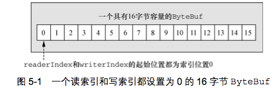

- 1. ByteBuf维护了readerIndex和writerIndex索引
- 2. 当readerIndex > writerIndex时，则抛出IndexOutOfBoundsException
- 3. ByteBuf容量 = writerIndex。
- 4. ByteBuf可读容量 = writerIndex - readerIndex
- 5. readXXX()和writeXXX()方法将会推进其对应的索引。自动推进
- 6. getXXX()和setXXX()方法将对writerIndex和readerIndex无影响

### 5.2.2 ByteBuf的使用模式
ByteBuf本质是: 一个由不同的索引分别控制读访问和写访问的字节数组。请记住这句话。ByteBuf共有三种模式: 堆缓冲区模式(Heap Buffer)、直接缓冲区模式(Direct Buffer)和复合缓冲区模式(Composite Buffer)

##### 1. 堆缓冲区模式(Heap Buffer)
堆缓冲区模式又称为：支撑数组(backing array)。将数据存放在JVM的堆空间，通过将数据存储在数组中实现

- 1. 堆缓冲的优点: 由于数据存储在Jvm堆中可以快速创建和快速释放，并且提供了数组直接快速访问的方法
- 2. 堆缓冲的缺点: 每次数据与I/O进行传输时，都需要将数据拷贝到直接缓冲区

##### 代码:
```
public static void heapBuffer() {
    // 创建Java堆缓冲区
    ByteBuf heapBuf = Unpooled.buffer(); 
    if (heapBuf.hasArray()) { // 是数组支撑
        byte[] array = heapBuf.array();
        int offset = heapBuf.arrayOffset() + heapBuf.readerIndex();
        int length = heapBuf.readableBytes();
        handleArray(array, offset, length);
    }
}
```

##### 2. 直接缓冲区模式(Direct Buffer)
Direct Buffer属于堆外分配的直接内存，不会占用堆的容量。适用于套接字传输过程，避免了数据从内部缓冲区拷贝到直接缓冲区的过程，性能较好

- 1. Direct Buffer的优点: 使用Socket传递数据时性能很好，避免了数据从Jvm堆内存拷贝到直接缓冲区的过程。提高了性能
- 2. Direct Buffer的缺点: 相对于堆缓冲区而言，Direct Buffer分配内存空间和释放更为昂贵
- 3. 对于涉及大量I/O的数据读写，建议使用Direct Buffer。而对于用于后端的业务消息编解码模块建议使用Heap Buffer

##### 代码:
```java
public static void directBuffer() {
    ByteBuf directBuf = Unpooled.directBuffer();
    if (!directBuf.hasArray()) {
        int length = directBuf.readableBytes();
        byte[] array = new byte[length];
        directBuf.getBytes(directBuf.readerIndex(), array);
        handleArray(array, 0, length);
    }
}
```

##### 3. 复合缓冲区模式(Composite Buffer)
Composite Buffer是Netty特有的缓冲区。本质上类似于提供一个或多个ByteBuf的**组合视图**，可以根据需要添加和删除不同类型的ByteBuf。

- 1. 想要理解Composite Buffer，请记住：它是一个组合视图。它提供一种访问方式让使用者自由的组合多个ByteBuf，避免了拷贝和分配新的缓冲区。
- 2. Composite Buffer不支持访问其支撑数组。因此如果要访问，需要先将内容拷贝到堆内存中，再进行访问
- 3. 下图是将两个ByteBuf：头部+Body组合在一起，没有进行任何复制过程。仅仅创建了一个视图

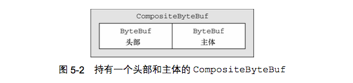

##### 代码:
```
public static void byteBufComposite() {
	// 复合缓冲区，只是提供一个视图
    CompositeByteBuf messageBuf = Unpooled.compositeBuffer();
    ByteBuf headerBuf = Unpooled.buffer(); // can be backing or direct
    ByteBuf bodyBuf = Unpooled.directBuffer();   // can be backing or direct
    messageBuf.addComponents(headerBuf, bodyBuf);
    messageBuf.removeComponent(0); // remove the header
    for (ByteBuf buf : messageBuf) {
        System.out.println(buf.toString());
    }
}
```

## 5.3 字节级操作

### 5.3.1 随机访问索引
ByteBuf的索引与普通的Java字节数组一样。第一个字节的索引是0，最后一个字节索引总是capacity()-1。请记住下列两条，非常有用:

- 1. readXXX()和writeXXX()方法将会推进其对应的索引readerIndex和writerIndex。自动推进
- 2. getXXX()和setXXX()方法用于访问数据，对writerIndex和readerIndex无影响

##### 代码:
```
public static void byteBufRelativeAccess() {
    ByteBuf buffer = Unpooled.buffer(); //get reference form somewhere
    for (int i = 0; i < buffer.capacity(); i++) {
        byte b = buffer.getByte(i);// 不改变readerIndex值
        System.out.println((char) b);
    }
}
```

### 5.3.2 顺序访问索引
Netty的ByteBuf同时具有读索引和写索引，但JDK的ByteBuffer只有一个索引，所以JDK需要调用flip()方法在读模式和写模式之间切换。

- 1. ByteBuf被读索引和写索引划分成3个区域：可丢弃字节区域，可读字节区域和可写字节区域
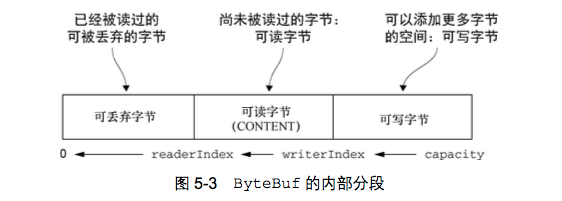

### 5.3.3 可丢弃字节区域
可丢弃字节区域是指:[0，readerIndex)之间的区域。可调用discardReadBytes()方法丢弃已经读过的字节。

- 1. discardReadBytes()效果 ----- 将可读字节区域(CONTENT)[readerIndex, writerIndex)往前移动readerIndex位，同时修改读索引和写索引。
- 2. discardReadBytes()方法会移动可读字节区域内容(CONTENT)。如果频繁调用，会有多次数据复制开销，对性能有一定的影响

### 5.3.4 可读字节区域
可读字节区域是指:[readerIndex, writerIndex)之间的区域。任何名称以read和skip开头的操作方法，都会改变readerIndex索引。

### 5.3.5 可写字节区域
可写字节区域是指:[writerIndex, capacity)之间的区域。任何名称以write开头的操作方法都将改变writerIndex的值。

### 5.3.6 索引管理

- 1. markReaderIndex()+resetReaderIndex() ----- markReaderIndex()是先备份当前的readerIndex，resetReaderIndex()则是将刚刚备份的readerIndex恢复回来。常用于dump ByteBuf的内容，又不想影响原来ByteBuf的readerIndex的值
- 2. readerIndex(int) ----- 设置readerIndex为固定的值
- 3. writerIndex(int) ----- 设置writerIndex为固定的值
- 4. clear() ----- 效果是: readerIndex=0, writerIndex(0)。不会清除内存
- 5. 调用clear()比调用discardReadBytes()轻量的多。仅仅重置readerIndex和writerIndex的值，不会拷贝任何内存，开销较小。

### 5.3.7 查找操作(indexOf)
查找ByteBuf指定的值。类似于，String.indexOf("str")操作

- 1. 最简单的方法 ----- indexOf(）
- 2. 利用ByteProcessor作为参数来查找某个指定的值。

##### 代码:
```
public static void byteProcessor() {
    ByteBuf buffer = Unpooled.buffer(); //get reference form somewhere
    // 使用indexOf()方法来查找
    buffer.indexOf(buffer.readerIndex(), buffer.writerIndex(), (byte)8);
    // 使用ByteProcessor查找给定的值
    int index = buffer.forEachByte(ByteProcessor.FIND_CR);
}
```

### 5.3.8 派生缓冲区 ----- 视图
派生缓冲区为ByteBuf提供了一个访问的视图。视图仅仅提供一种访问操作，不做任何拷贝操作。下列方法，都会呈现给使用者一个视图，以供访问:

-  1. duplicate() 
-  2. slice()
-  3. slice(int, int)
-  4. Unpooled.unmodifiableBuffer(...)
-  5. Unpooled.wrappedBuffer(...)
-  6. order(ByteOrder)
-  7. readSlice(int)

##### 理解
- 1. 上面的6中方法，都会返回一个新的ByteBuf实例，具有自己的读索引和写索引。但是，其内部存储是与原对象是共享的。这就是视图的概念
- 2. 请注意：如果你修改了这个新的ByteBuf实例的具体内容，那么对应的源实例也会被修改，因为其内部存储是共享的
- 3. 如果需要拷贝现有缓冲区的**真实副本**，请使用copy()或copy(int, int)方法。
- 4. 使用派生缓冲区，避免了复制内存的开销，有效提高程序的性能

##### 代码:
```
public static void byteBufSlice() {
    Charset utf8 = Charset.forName("UTF-8");
    ByteBuf buf = Unpooled.copiedBuffer("Netty in Action rocks!", utf8);
    ByteBuf sliced = buf.slice(0, 15);
    System.out.println(sliced.toString(utf8));
    buf.setByte(0, (byte)'J');
    assert buf.getByte(0) == sliced.getByte(0); // return true
}

public static void byteBufCopy() {
    Charset utf8 = Charset.forName("UTF-8");
    ByteBuf buf = Unpooled.copiedBuffer("Netty in Action rocks!", utf8);
    ByteBuf copy = buf.copy(0, 15);
    System.out.println(copy.toString(utf8));
    buf.setByte(0, (byte)'J');
    assert buf.getByte(0) != copy.getByte(0); // return true
}
```

### 5.3.9 读/写操作
如上文所提到的，有两种类别的读/写操作:

- 1. get()和set()操作 ----- 从给定的索引开始，并且保持索引不变
- 2. read()和write()操作 ----- 从给定的索引开始，并且根据已经访问过的字节数对索引进行访问
- 3. 下图给出get()操作API，对于set()操作、read()操作和write操作可参考书籍或API

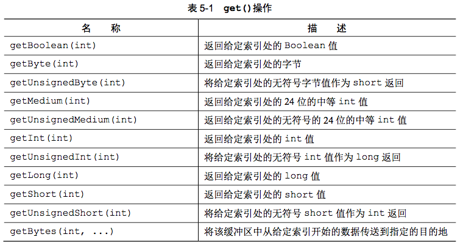

### 5.3.10 更多的操作
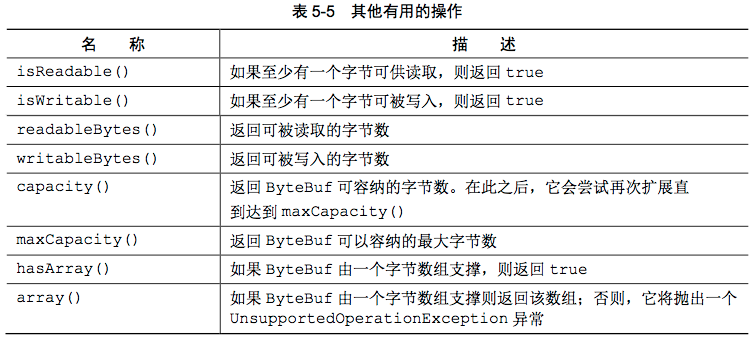
下面的两个方法操作字面意思较难理解，给出解释:

- 1. hasArray() ----- 如果ByteBuf由一个字节数组支撑，则返回true。通俗的讲：ByteBuf是堆缓冲区模式，则代表其内部存储是由字节数组支撑的。如果还没理解，可参考5.2.2章节
- 2. array() ----- 如果ByteBuf是由一个字节数组支撑泽返回数组，否则抛出UnsupportedOperationException异常。也就是，ByteBuf是堆缓冲区模式

## 5.4 ByteBufHolder接口
ByteBufHolder为Netty的高级特性提供了支持，如缓冲区池化，可以从池中借用ByteBuf，并且在需要时自动释放。

- 1. ByteBufHolder是ByteBuf的容器，可以通过子类实现ByteBufHolder接口，根据自身需要添加自己需要的数据字段。可以用于自定义缓冲区类型扩展字段。
- 2. Netty提供了一个默认的实现DefaultByteBufHolder。

##### 代码
```
public class CustomByteBufHolder extends DefaultByteBufHolder{

    private String protocolName;

    public CustomByteBufHolder(String protocolName, ByteBuf data) {
        super(data);
        this.protocolName = protocolName;
    }

    @Override
    public CustomByteBufHolder replace(ByteBuf data) {
        return new CustomByteBufHolder(protocolName, data);
    }

    @Override
    public CustomByteBufHolder retain() {
        super.retain();
        return this;
    }

    @Override
    public CustomByteBufHolder touch() {
        super.touch();
        return this;
    }

    @Override
    public CustomByteBufHolder touch(Object hint) {
        super.touch(hint);
        return this;
    }
    ...
}
```

## 5.5 ByteBuf分配
创建和管理ByteBuf实例的多种方式：按需分配(ByteBufAllocator)、Unpooled缓冲区和ByteBufUtil类

### 5.5.1 按序分配: ByteBufAllocator接口
Netty通过接口ByteBufAllocator实现了(ByteBuf的)池化。Netty提供池化和非池化的ButeBufAllocator: 

- 1. ctx.channel().alloc().buffer() ----- 本质就是: ByteBufAllocator.DEFAULT
- 2. ByteBufAllocator.DEFAULT.buffer() ----- 返回一个基于堆或者直接内存存储的Bytebuf。默认是堆内存
- 3. ByteBufAllocator.DEFAULT ----- 有两种类型: UnpooledByteBufAllocator.DEFAULT(非池化)和PooledByteBufAllocator.DEFAULT(池化)。对于Java程序，默认使用PooledByteBufAllocator(池化)。对于安卓，默认使用UnpooledByteBufAllocator(非池化)
- 4. 可以通过BootStrap中的Config为每个Channel提供独立的ByteBufAllocator实例

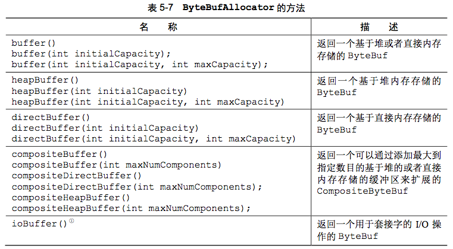

##### 解释:

- 1. 上图中的buffer()方法，返回一个基于堆或者直接内存存储的Bytebuf ----- 缺省是堆内存。源码: AbstractByteBufAllocator() { this(false); }
- 2. ByteBufAllocator.DEFAULT ----- 可能是池化，也可能是非池化。默认是池化(PooledByteBufAllocator.DEFAULT)

### 5.5.2 Unpooled缓冲区 ----- 非池化
Unpooled提供静态的辅助方法来创建未池化的ByteBuf。

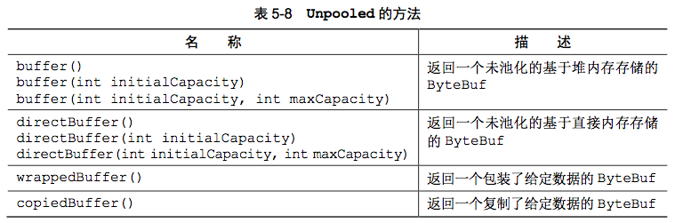

##### 注意:

- 1. 上图的buffer()方法，返回一个未池化的基于堆内存存储的ByteBuf
- 2. wrappedBuffer() ----- 创建一个视图，返回一个包装了给定数据的ByteBuf。非常实用

##### 创建ByteBuf代码:
```
 public void createByteBuf(ChannelHandlerContext ctx) {
    // 1. 通过Channel创建ByteBuf
    ByteBuf buf1 = ctx.channel().alloc().buffer();
    // 2. 通过ByteBufAllocator.DEFAULT创建
    ByteBuf buf2 =  ByteBufAllocator.DEFAULT.buffer();
    // 3. 通过Unpooled创建
    ByteBuf buf3 = Unpooled.buffer();
}
```

### 5.5.3 ByteBufUtil类
ByteBufUtil类提供了用于操作ByteBuf的静态的辅助方法: hexdump()和equals

- 1. hexdump() ----- 以十六进制的表示形式打印ByteBuf的内容。非常有价值 
- 2. equals() ----- 判断两个ByteBuf实例的相等性

## 5.6 引用计数
Netty4.0版本中为ButeBuf和ButeBufHolder引入了引用计数技术。请区别引用计数和可达性分析算法(jvm垃圾回收)

- 1. 谁负责释放: 一般来说，是由最后访问(引用计数)对象的那一方来负责将它释放
- 2. buffer.release() ----- 引用计数减1 
- 3. buffer.retain() ----- 引用计数加1
- 4. buffer.refCnt() ----- 返回当前对象引用计数值
- 5. buffer.touch() ----- 记录当前对象的访问位置，主要用于调试。
- 6. 引用计数并非仅对于直接缓冲区(direct Buffer)。ByteBuf的三种模式: 堆缓冲区(heap Buffer)、直接缓冲区(dirrect Buffer)和复合缓冲区(Composite Buffer)都使用了引用计数，某些时候需要程序员手动维护引用数值

##### 代码：
```
public static void releaseReferenceCountedObject(){
    ByteBuf buffer = ByteBufAllocator.DEFAULT.buffer();
    // 引用计数加1
    buffer.retain();
    // 输出引用计数
    buffer.refCnt();
    // 引用计数减1
    buffer.release();
}
```

## 5.7 建议
- 1. 如果使用了Netty的ByteBuf，建议功能测试时，打开内存检测: -Dio.netty.leakDetectionLevel=paranoid
- 2. ByteBuf的三种模式: 堆缓冲区(heap Buffer)、直接缓冲区(dirrect Buffer)和复合缓冲区(Composite Buffer)都使用了引用计数，某些时候需要程序员手动维护引用数值。

# 第6章 ChannelHandler和ChannelPipeline

## 6.1 ChannelHandler家族

### 6.1.1 Channel的生命周期
- 1. ChannelUnregistered ----- Channel已经被创建，但未注册到EventLoop上
- 2. ChannelRegistered ----- Channel已经被注册到EventLoop上
- 3. ChannelActive ----- Channel处于活动状态。对于Tcp客户端是只有与远程建立连接后，channel才会变成Active。udp是无连接的协议，Channel一旦被打开，便激活。注意这点不同点
- 4. ChannelInactive ----- Channel处于关闭状态。常用来发起重连或切换链路

### 6.1.2 ChannelHandler的生命周期
ChannelHandler被添加到ChannelPipeline中或者被从ChannelPipeline中移除时将调用下列操作:

- 1. handlerAdded ----- ChannelHandler被添加到ChannelPipeline中时被触发
- 2. handlerRemoved ----- ChannelHandler被从ChannelPipeline中移除时触发
- 3. exceptionCaught ----- 处理过程中发生异常，则触发

Netty提供了两个重要的ChannelHandler子接口:

- 1. ChannelInboundHandler ----- 处理入站数据和入站事件
- 2. ChannelOutboundHandler ----- 处理出站数据并且允许拦截所有的操作

### 6.1.3 ChannelInboundHandler接口
ChannelInboundHandler接口处理入站事件和入站数据，提供的事件方法如下图:

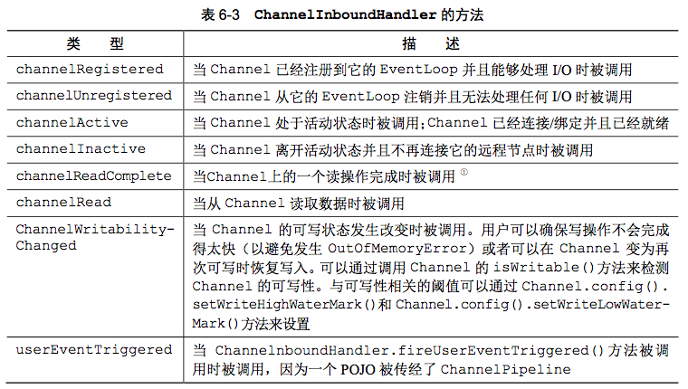

###### 提醒:
解释上图中的几个方法，帮助理解与学习:

- 1. channelReadComplete ----- Channel一次读操作完成时被触发，开始准备切换为写操作。Channel是一个数据载体，既可以写入数据，又可以读取数据。所以存在读操作和写操作切换。
- 2. channelWritabilityChanged ----- 帮助用户控制写操作速度，以避免发生OOM异常。通过Channel.config().setWriteHighWaterMark()设置发送数据的高水位。
- 3. userEventTriggered ----- 用户事件触发。Netty提供心跳机制中使用，请参考netty-private-protocol开发子项目，[子项目地址](https://github.com/thinkingfioa/netty-learning/tree/master/netty-private-protocol)
- 4. userEventTriggered ----- 实现用户自定义事件，完成ChannelPipeline动态编排效果的实现。请参考另一个子项目中动态编排ChannelHandler案例，[子项目地址](https://github.com/thinkingfioa/netty-learning/tree/master/netty-small-demo)

### 6.1.4 ChannelOutboundHandler接口
出站数据和事件将由ChannelOutboundHandler处理。ChannelOutboundHandler大部分方法都需要一个ChannelPromise参数，以便在操作完成时得到通知。

- 1. ChannelPromise是ChannelFuture的一个子类，使用setSuccess()和setFailure()方法告知操作结果。ChannelPromise设置结果后，将变成不可修改对象。

### 6.1.5 ChannelHandler适配器
Netty提供两个ChannelHandler适配器: ChannelInboundHandlerAdapter和ChannelOutboundHandlerAdapter。通常自己实现处理业务的Handler都是继承这两个适配器

- 1. ChannelHandlerAdapter适配器中的一个使用的方法: isSharable() ----- 标记该Handler被标注为Sharable。可在多个ChannelPipeline共享一个实例

### 6.1.6 资源管理
Netty使用的ByteBuf采用的是引用计数机制来回收。对于初学者非常容易造成资源泄漏。Netty提供以下帮助定位资源泄漏代码。推荐使用Java系统属性设置方法: java -Dio.netty.leadDetectionLevel=ADVANCED

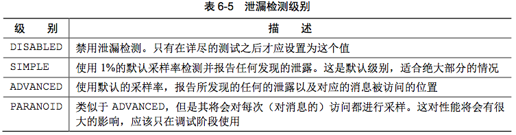

##### 如何管理好资源:
想要管理好资源，避免资源浪费，请记住以下几点:

- 1. 三种ByteBuf(堆缓冲区、直接缓冲区和复合缓冲区)都采用的引用计数方式维护对象。所以都可能需要程序员参与管理资源。对于刚使用ByteBuf的程序员来说，存在误区：以为只有直接缓冲区才使用引用计数。
- 2. 如果当前ByteBuf被Channel调用write(...)或writeAndFlush(...)方法，则Netty会自动执行引用计数减1操作，释放该ByteBuf
- 3. 谁负责释放: 一般来说，是由最后访问(引用计数)对象的来负责释放该对象
- 4. 如果是SimpleChannelInboundHandler的子类，传入的参数msg，会被SimpleChannelInboundHandler自动释放一次

## 6.2 ChannelPipeline接口
ChannelPipeline是一个拦截流经Channel的入站和出站事件的ChannelHandler实例链。需要记住以下几个重要的点:

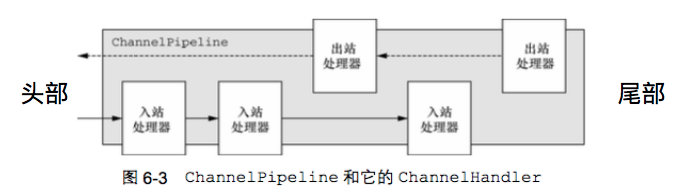

- 1. ChannelHandler是组成ChannelPipeline链的节点，也就是对应于上图的入站处理器和出站处理器
- 2. ChannelPipeline的头部和尾部是固定不变的。如上图6.3所示
- 3. 在一个ChannelPipeline链上，ChannelHandlerContext与ChannelHandler是1:1对应的。也就是说，每一个ChannelHandler都有一个自己的ChannelHandlerContxt。后文会详细讲述
- 4. 每次Channel收到的消息，流转路径是: 头部 -> 尾部。每次Channel调用一次write操作时，流转路径是: 尾部 -> 头部
- 5. 重要的事情说三遍: 不要阻塞ChannelChandler,不要阻塞ChannelChandler,不要阻塞ChannelChandler。否则，可能会影响其他的Channel处理。原因见：3.1.2章节

### 6.2.1 修改ChannelPipeline
Netty允许的修改ChannelPipeline链上的ChannelHandler。有一个案例，利用userEventTriggered机制，实现ChannelHandler动态编排效果的实现.参考另一个子项目中动态编排ChannelHandler案例。 [子项目地址](https://github.com/thinkingfioa/netty-learning/tree/master/netty-small-demo)

### 6.2.2 入站操作和出站操作
ChannelPipeline入站操作
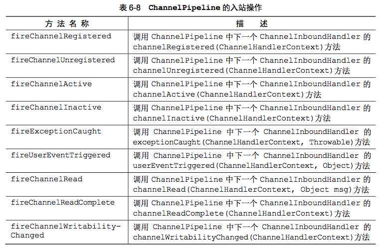

ChannelPipeline出站操作
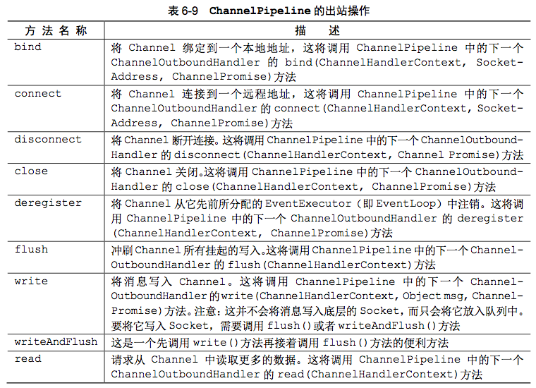

## 6.3 ChannelHandlerContext 接口
- 1. ChannelHandlerContext对象实例与ChannelHandler对象实例的关系是n:1的关系。如果从单个ChannelPipeline来看，一个ChannelHandlerContext对象实例对应于一个ChannelHandler对象实例.
- 2. ChannelHandlerContext的许多方法与Channel或者ChannelPipeline上方法类似。但是有一点非常大的不同点: 调用Channel或者ChannelPipeline上的这些方法，将沿着整个ChannelPipeline进行传播。而调用ChannelHandlerContext上的相同方法，则将从当前关联的Channelhandler开始，并且只会传播给位于该ChannelPipeline上的下一个能够处理该事件的ChannelHandler。如果对于这个点没有看懂，请看下文6.5.2章节，帮助理解。
- 3. handler() ----- 返回绑定到这个实力的ChannelHandler。

##### 注意点:
- 1. ChannelHandlerContext和ChannelHandler之间的关联是永远不变的，所以缓存对它的引用是安全且可行的。如上6.3章节中第一点所描述的。
- 2. 相对于Channel和ChannelPipeline上的方法，ChannelHandlerContext的方法将产生更短的事件流(解释如上述6.3章节的第二点)，所以性能也会更优秀。

### 6.3.1 使用ChannelHandlerContext
下图充分说明了ChannelHandlerContext在ChannelPipeline充当的作用，我们可以从图中发现

- 1. 对于单个ChannelPipeline来看，ChannelHandlerContext和ChannelHandler的关联关系是1:1
- 2. ChannlePipeline中事件的传递，原来是依赖于ChannelHandlerContext实现的。
- 3. 图中AContext将事件(read)传递给BHandler，BContext再将事件(read)传递给了Chandler。
- 4. 如果想从特定的Handler传播事件，需要获取上一个ChannelHandlerContext。比如：希望事件从CHandler开始传播，跳过AHandler和BHandler，则获取到BContext即可。

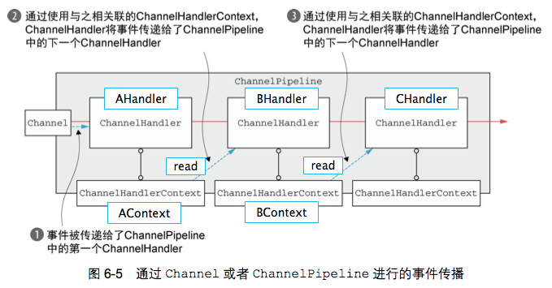

### 6.3.2 ChannelHandler和ChannelHandlerContext高级用法
- 1. ChannelHandler可以使用@Sharable注解标注，可以将一个ChannelHandler绑定到多个ChannelPipeline链中，也就绑定到多个ChannelhandlerContext。
- 2. ChannelHandler使用@Sharable注解标注后。多个线程会访问同一个ChannelHandler，开发人员需要考虑多个线程操作同一个ChannelHandler实例，会不会存在同步互斥问题。

## 6.4 异常处理
Netty提供几种方式用于处理入站或者出站处理过程中所抛出的异常。

### 6.4.1 处理入站异常
- 1. 入站事件发生异常时，从异常发生的ChannelHandler开始，沿着ChannelPipeline链向后传播。前面的ChannelHandler中的exceptionCaught(...)不会被执行。
- 2. 如果想处理入站异常，则需要重写方法exceptionCaught(...)
- 3. 建议在ChannelPipeline链的尾部，添加处理入站异常的ChannelHandler

### 6.4.2 处理出站异常
出站异常的处理与入站异常截然不同。出站异常通过异步通知机制实现:

- 1. 每个出站操作都将返回一个ChannelFuture。注册到ChannelFuture的ChannelFutureListener将在操作完成后通知调用方操作成功还是出错了
- 2. 几乎所有的ChannelOutboundHandler上的方法都会传入一个ChannelPromise的实例。ChannelPromise提供立即通知的可写方法:setSuccess()/setFailure(Throwable cause)，通知调用方操作完成结果。

##### 第一种方法(6.4.2.1)代码实现:
```
public static void addingChannelFutureListener(ChannelHandlerContext ctx){
    Channel channel = ctx.channel();
    ByteBuf someMessage = Unpooled.buffer();
    //...
    io.netty.channel.ChannelFuture future = channel.write(someMessage);
    future.addListener((ChannelFuture f) -> {
        if (f.isSuccess()) {
            // operation success.
            System.out.println("success.");
        }else {
            // operation fail
            f.cause().printStackTrace();
        }
    });
}
```

##### 第二种方法(6.4.2.2)代码实现:
```
public void write(ChannelHandlerContext ctx, Object msg, ChannelPromise promise) {
    ctx.write(msg, promise);
    promise.addListener((ChannelFuture f) -> {
        if (f.isSuccess()) {
            // operation success.
            System.out.println("success.");
        }else {
            // operation fail
            f.cause().printStackTrace();
        }
    });
}
```

## 6.5 如何理解ChannelHandler、ChannelPipeline和ChannelHandlerContext关系
ChannelHandler、ChannelPipeline和ChannelHandlerContext是Netty3个非常重要的组件，博主写了几个例子，帮助读者进一步理解和使用这三个组件

### 6.5.1 实现动态编排ChannelHandler
实际开发中，往往在初始化ChannelPipeline时候，无法确定程序需要添加的所有ChannelHandler。所以，采用动态的添加ChannelHandler。另一个子项目中给出动态编排ChannelHandler的具体代码。参见[项目地址](https://github.com/thinkingfioa/netty-learning/tree/master/netty-small-demo)


### 6.5.2 ctx.write(...)和channel.write(...)本质区别
下图是一个ChannelPipeline链。分别由4个入站Handler和5个出站Handler。入站Handler和出站Handler彼此之间交错排列。蓝色箭头是事件在ChannelPipeline链上的传播方向。

假设ChannelInboundHandler_3调用ctx.write(...)或channel.write(...)方法，分别会将出站写事件传播给序号为7或5的Handler。两个方法有着本质的不同，具体详述请参见6.3章节的第二点的论述观点。参见[子项目地址](https://github.com/thinkingfioa/netty-learning/tree/master/netty-small-demo)

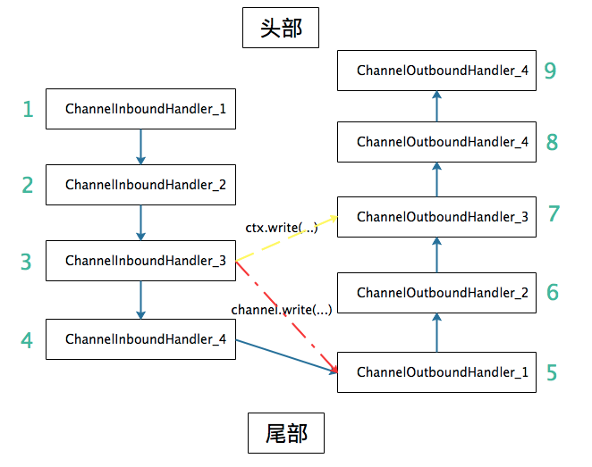

# 附录
- 1. [完整代码地址](https://github.com/thinkingfioa/netty-learning/tree/master/netty-in-action)
- 2. [netty-in-action书籍下载地址](https://github.com/thinkingfioa/netty-learning/tree/master/netty-in-action/docs)


